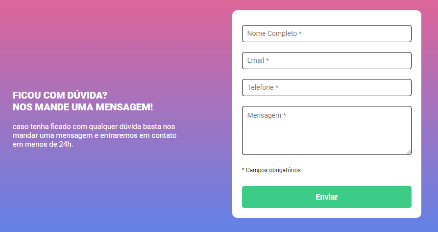
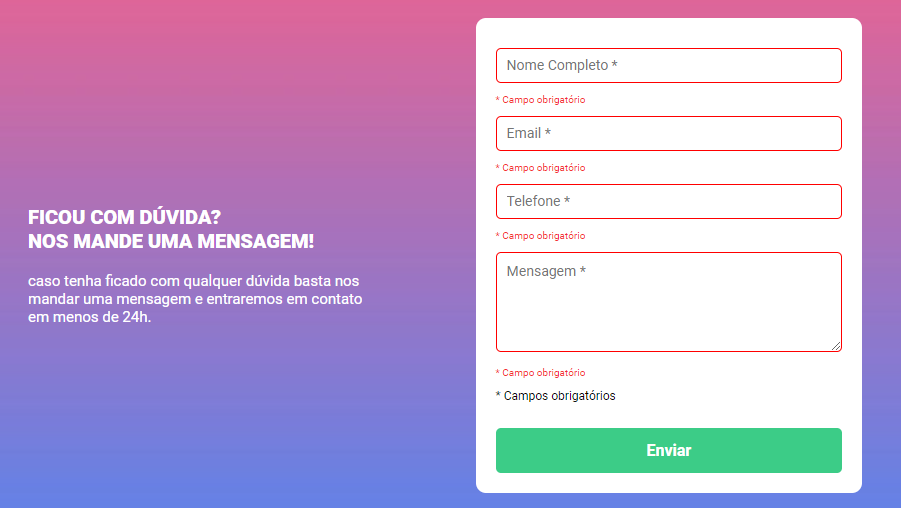
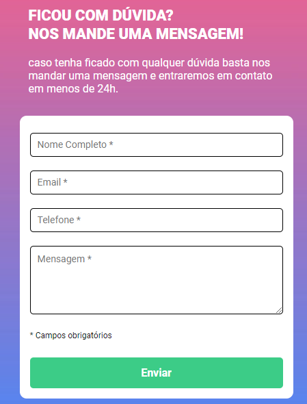

# Desafio HTML/CSS/JS
## Projeto formulário DevQuest

####  Tela principal

#### Tela principal com compos obrigatórios 

#### Versão mobile

## Tecnologias usadas

- HTML 
- CSS 
- JS

 # Social media

 - 👋🏾 [Linkedin](https://www.linkedin.com/in/matheus17martins/)
 - 💻 [Github](https://github.com/ma17martins)